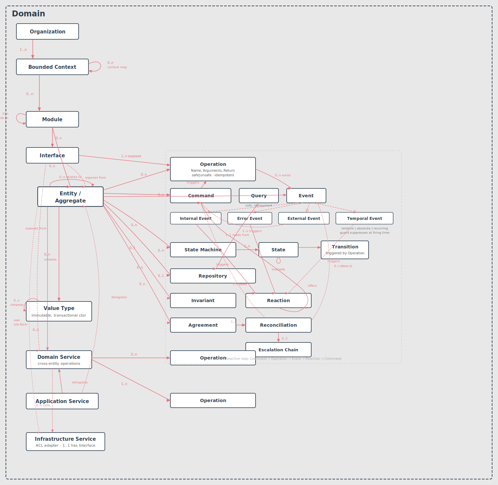
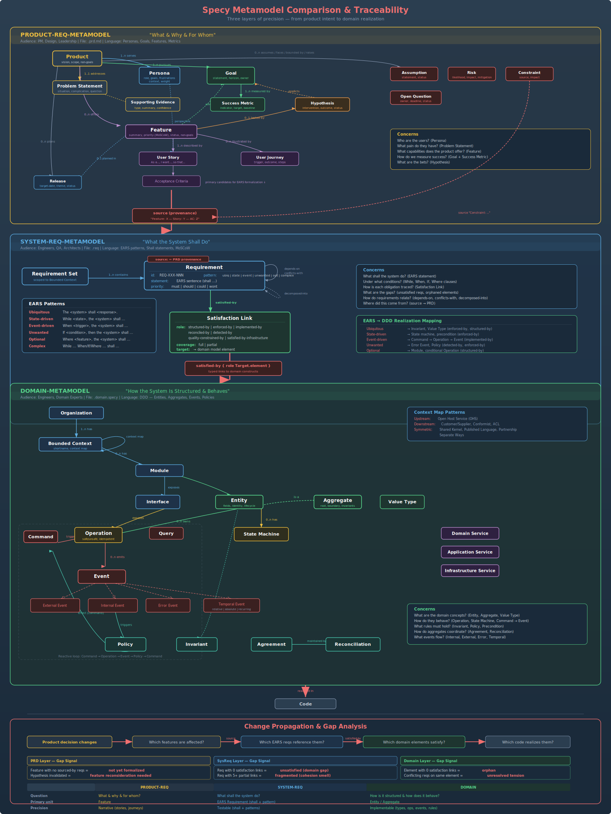

# Specy

> **Capture business knowledge as living models — then design, reverse-engineer, explore, and generate code from it, with full traceability from product vision to implementation.**

[](./LICENSE)
[](https://github.com/specy-ai/skills)
[](#skills)
[](#contributing)



Specy is a Domain-Driven Design toolkit that ships as a **Claude Code plugin** (`specy`). Its AI-assisted skills work across three structured DSLs:

- **`.prd`** — product requirements (the *why* and *what*)
- **`.sysreq`** — system requirements in EARS syntax (the formal *what*)
- **`.domain`** — the domain model in DDD notation (the *how*)

A companion parser/CLI additionally renders a `.domain` model to **JSON, YAML, or Markdown**.

## Why Specy?

Business knowledge — rules, invariants, constraints, operational decisions — is the real asset; **code is a derivation.** Yet most of that knowledge lives only in people's heads and scattered across a codebase, so it evaporates on every rewrite and every AI-generated change quietly drifts from intent.

Specy makes that knowledge **explicit, traceable, and executable.** Model it once and every element stays linked along a single chain — product vision (`.prd`) → testable requirement (`.sysreq`) → domain model (`.domain`) → generated code — and back again.

> *Why not just prompt the LLM directly?* A prompt is throwaway and unverifiable. A Specy model is a durable, reviewable artifact you can diff, trace, regenerate code from, and reverse-engineer out of legacy code.

## Quick start

```bash
git clone https://github.com/specy-ai/skills.git specy && cd specy
./src/skills/build.sh          # build the `specy` plugin → dist/
./install-skills-for-user.sh   # install into ~/.claude/skills/specy
```

Then, in Claude Code:

```
specy:prd-design          # capture product requirements from an idea or brief
specy:domain-design       # model a domain from requirements or prose
specy:domain-build-code   # generate code (Java/Spring, TS/NestJS, Clojure) from a .domain
specy:domain-extract-from-code   # reverse-engineer a .domain from an existing codebase
```

Full options in [Setup](#setup); browse complete models in [`examples/`](./examples).

## See it work

A few lines of `.domain` …

```
value Slug {
  value : String
  invariant "max-length" { value.length <= 30 }
}

entity ShortLink {
  id : ShortLinkId
  slug : Slug
  status : LinkStatus
}
```

… become idiomatic code via `specy:domain-build-code` (Java/Spring shown):

```java
public record Slug(String value) {                 // immutable value, validated at construction
    public Slug {
        if (value.length() > 30)
            throw new IllegalArgumentException("A slug must not exceed 30 characters");
    }
}

public final class ShortLink {                      // aggregate root — no public setters
    private final ShortLinkId id;
    private Slug slug;
    private LinkStatus status;
    // state changes only through domain operations; satisfies traceability carried as annotations
}
```

The same model can also be rendered to JSON/YAML/Markdown, explored conversationally, or kept in sync with code — see [Skills](#skills).

## Table of Contents

- [Skills](#skills)
- [Two Approaches](#two-approaches)
- [Metamodels](#metamodels)
- [Folder Structure](#folder-structure)
- [Prerequisites](#prerequisites)
- [Setup](#setup)
- [Usage](#usage)
- [LSP Server](#lsp-server)
- [Contributing](#contributing)

## Skills

Specy ships as a single Claude Code plugin — **`specy`** — providing 7 AI-assisted skills: 6 **core**
skills named after their input→output artefact, plus 1 **auxiliary** skill. Each is invoked as
`specy:<name>`.

| Skill | Input | Output |
|---|---|---|
| `specy:prd-design` | product idea / brief / prose | `.prd` |
| `specy:sysreq-design` | `.prd` / business rules / prose | `.sysreq` (EARS) |
| `specy:sysreq-extract-from-code` | codebase | `.sysreq` (EARS) |
| `specy:domain-design` | `.sysreq` / `.prd` / prose | `.domain` |
| `specy:domain-build-code` | `.domain` + target stack | source code |
| `specy:domain-extract-from-code` | codebase | `.domain` (+ refactoring report) |
| `specy:domain-dialogue` *(aux)* | `.domain` | — (read-only conversation) |

### `specy:prd-design` — Product Requirements

**Input:** a product idea, brief, or business context in prose. **Output:** a `.prd` file.

Guides creation of a `.prd` file. Interactive 7-phase conversation (Problem & Vision, Personas & Jobs,
Goals & Metrics, Evidence & Hypotheses, Features & Stories, Risks & Constraints, Journeys & Releases),
or one-shot from a brief.

### `specy:sysreq-design` — System Requirements

**Input:** a `.prd`, business rules, or prose. **Output:** a `.sysreq` file (EARS).

Formalizes testable system requirements in EARS syntax. Interactive 4-phase (Context, Functional
Requirements, NFR Discovery, Cross-Requirement Analysis), or one-shot from a `.prd` with
feature-to-requirement mapping and gap analysis.

### `specy:sysreq-extract-from-code` — Requirements from Code

**Input:** a codebase. **Output:** a `.sysreq` file (EARS) per bounded context.

Reverse-engineers what the code *actually does* into testable EARS requirements (bottom-up). For a
domain model from code instead, use `specy:domain-extract-from-code`.

### `specy:domain-design` — Domain Modeling

**Input:** a `.sysreq`, `.prd`, or prose description of business logic. **Output:** a `.domain` file.

Builds a DDD model. Interactive 7-phase conversation (Bounded Contexts, Entities/Aggregates/Values,
Operations/Commands/Events, State Machines, Invariants/Reactions/Properties, Services, Traceability)
with DDD quality challenges, or one-shot from `.sysreq`/`.prd` with requirement traceability.

### `specy:domain-build-code` — Code Generation

**Input:** a `.domain` model + a target stack. **Output:** idiomatic source code for every building block.

Generates a hexagonal source tree from a domain model — mapping entities, value types, aggregates,
commands, queries, events, operations, reactions, invariants, repositories, and domain/application/
infrastructure services to a chosen stack (**Java/Spring, TypeScript/NestJS, Clojure**), preserving
`satisfies` traceability as code annotations. The inverse of `specy:domain-extract-from-code`.

### `specy:domain-extract-from-code` — Domain from Code

**Input:** source code in any supported language. **Output:** a `.domain` file + `specy/refactoring.report` + `specy/.meta.json`.

Reverse-engineers source code into a `.domain` model and produces DDD refactoring recommendations.
Creation / incremental (`git diff` + `.meta.json`) / targeted modes; stack-specific heuristics for
Java/Spring, TypeScript/NestJS, Clojure; test-aware enrichment.

### `specy:domain-dialogue` — Domain Exploration *(auxiliary)*

**Input:** existing `.domain` files. **Output:** none — a read-only conversation.

Navigates the domain-model graph (organization → operation clauses), synthesizing, tracing, and
challenging the model without modifying it. Modes: Explorer, Questioner, Confronter, Completer. When a
change is warranted, it points back to `specy:domain-design` to evolve the model.

## Two Approaches

Specy supports two complementary approaches to domain modeling. Both converge on the same artifact — the `.domain` file — and once it exists, the other skills can operate on it (explore and generate code).

```
     Top-down (greenfield)                Bottom-up (brownfield)

     Business vision                      Existing codebase
          │                                      │
          ▼                                      ▼
  specy:prd-design → .prd          specy:domain-extract-from-code → .domain
          │                                      │
          ▼                                      ▼
 specy:sysreq-design → .sysreq        specy:domain-dialogue (explore)
          │                                      │
          ▼                                      ▼
 specy:domain-design → .domain ◄────────► specy:domain-design (evolve)
          │                                      │
          ▼                                (implement + re-extract)
 specy:domain-build-code → code
```

### Top-down: from product vision to domain model

Start with *why* (product vision, personas, jobs-to-be-done) and progressively formalize *what* the system should do (testable requirements) then *how* the domain is structured (entities, operations, rules).

1. **`specy:prd-design`** — capture the product vision: problem statement, personas, goals, hypotheses, features, user stories, and releases into a `.prd` file.
2. **`specy:sysreq-design`** — formalize testable system requirements in EARS syntax from the PRD, producing a `.sysreq` file with traceability back to features.
3. **`specy:domain-design`** — build the domain model from requirements: entities, aggregates, commands, events, operations, state machines, invariants, reactions. Each construct traces back to specific requirements via `satisfies`.
4. **`specy:domain-build-code`** — generate idiomatic source code for every building block of the `.domain`, for a chosen stack.

This is the **greenfield** path — no code exists yet. Knowledge flows from intent to structure to code.

### Bottom-up: from existing code to explicit knowledge

Start with *what exists* (source code) and extract the implicit business knowledge into an explicit, verifiable model. Then explore it, challenge it, and evolve it.

1. **`specy:domain-extract-from-code`** — reverse-engineer source code into `.domain` files. The extracted model becomes the source of truth for the other skills. (Use **`specy:sysreq-extract-from-code`** to recover EARS requirements from code.)
2. **`specy:domain-dialogue`** — explore and question the domain model through conversation. Surface gaps, trace behaviors, challenge assumptions.
3. **`specy:domain-design`** — when a change is needed, evolve the model. **`specy:domain-build-code`** then regenerates the affected code.
4. The developer implements the change, then runs **`specy:domain-extract-from-code`** (incremental) to bring the model back in sync with the code.

This is the **brownfield** path — code already exists. Knowledge flows from implementation to model, and change proposals flow from model back to code.

## Metamodels

Specy organizes business knowledge into three layers, each with its own metamodel, file format, and grammar. Together they form a **traceability chain** from product vision down to domain implementation.



### Product Requirements (`.prd`)

**Purpose:** Capture the *why* and *what* of a product — the problem, the people, and the intended value — before any solution is designed.

A `.prd` file structures product thinking into traceable concepts: problem statement, personas, jobs-to-be-done, desired outcomes, goals with success metrics, hypotheses, features, user stories, user journeys, risks, assumptions, constraints, open questions, and releases.

**Traceability:** each feature traces to goals and personas; each user story traces to a feature; each release groups features. The PRD feeds into system requirements via feature-to-requirement coverage.

<details>
<summary><b>PRD key concepts</b></summary>

| Concept | Description |
|---------|-------------|
| Problem Statement | The core problem the product addresses, with supporting evidence |
| Persona | An archetype of a user segment, with context and pain points |
| Job | A job-to-be-done (JTBD) — what the persona is trying to accomplish |
| Desired Outcome | What success looks like from the persona's perspective |
| Goal | A measurable business objective tied to success metrics |
| Hypothesis | A testable assumption linking a feature to an expected outcome |
| Feature | A capability the product provides, traceable to goals and personas |
| User Story | A concrete behavior within a feature, with acceptance criteria |
| User Journey | A sequence of steps a persona takes to accomplish a job |
| Release | A time-boxed delivery grouping features by priority (MoSCoW) |

</details>

### System Requirements (`.sysreq`)

**Purpose:** Formalize *what the system shall do* in testable, unambiguous EARS statements — bridging product intent and domain modeling.

A `.sysreq` file contains requirement sets grouped by feature or capability, using the **EARS** (Easy Approach to Requirements Syntax) patterns. Each requirement has a unique ID, a priority (MoSCoW), and traces back to a PRD feature.

**Traceability:** each requirement set links to a PRD feature via `feature-ref`; each requirement has a unique ID (e.g., `REQ-ORD-001`) that domain model constructs reference via `satisfies`.

<details>
<summary><b>EARS patterns &amp; key concepts</b></summary>

| Pattern | Template | When to use |
|---------|----------|-------------|
| Ubiquitous | "The system shall..." | Always-on behavior |
| State-driven | "While [state], the system shall..." | Behavior tied to a system state |
| Event-driven | "When [event], the system shall..." | Behavior triggered by an event |
| Unwanted | "If [condition], then the system shall..." | Error handling, edge cases |
| Optional | "Where [feature], the system shall..." | Feature-gated behavior |
| Complex | Combines two or more patterns | Multi-condition requirements |

| Concept | Description |
|---------|-------------|
| Requirement Set | A group of related requirements, traced to a PRD feature |
| Requirement | A single EARS statement with ID, priority, and rationale |
| NFR (Non-Functional) | Performance, security, availability, scalability requirements |
| Traceability | `prd-source` links to the originating `.prd` file |

</details>

### Domain Model (`.domain`)

**Purpose:** Model the deep business logic — entities, their behaviors, rules, state machines, and cross-aggregate consistency — in a formal DDD notation.

A `.domain` file captures the full domain model for a bounded context: the structural concepts (what exists), the behavioral concepts (what happens), and the properties (what must hold true). It uses a hierarchical structure: `organization > context > module`.

**Traceability:** `requirements-source` links to the `.sysreq` file; individual constructs use `satisfies [REQ-XXX-001]` to trace back to specific requirements.

<details>
<summary><b>Domain key concepts</b></summary>

| Concept | Description |
|---------|-------------|
| Entity | Domain object with identity, mutable state, and lifecycle |
| Aggregate | Group of entities with a root, enforcing integrity boundaries |
| Value | Immutable object defined by its attributes (no identity) |
| Command | Intent to change domain state (input DTO for write operations) |
| Query | Request for current state (safe, idempotent read) |
| Event | Recorded fact: internal, external (from upstream), error, or temporal |
| Operation | Named behavior owned by an entity — command-triggered or event-triggered |
| Precondition | Named guard on an operation (`rejects` with message) |
| Reaction | Reactive rule: listens to an event, issues a command (triggered-by/effects) |
| Invariant | Safety property that must hold after any mutation (with enforcement strategy) |
| Agreement | Cross-aggregate consistency property with reconciliation mechanism |
| State Machine | Named lifecycle with states, transitions, guards, and actions |
| Domain Service | Stateless business logic spanning multiple entities |
| Application Service | Use case orchestrator from presentation layer |
| Infrastructure Service | External system adapter (notifications, payments, storage) |
| Interface | Named surface exposing a subset of operations |

</details>

## Folder Structure

```
specy-skill/
├── src/                          # All source material (humans edit here)
│   ├── skills/                   # Skill templates and build system
│   │   ├── build.sh              # Assembles dist/ plugin (skills + manifest) from templates
│   │   ├── plugin/               # Plugin manifest template (plugin.json)
│   │   ├── prd-design/           # specy:prd-design source
│   │   ├── sysreq-design/        # specy:sysreq-design source
│   │   ├── sysreq-extract-from-code/   # specy:sysreq-extract-from-code source
│   │   ├── domain-design/        # specy:domain-design source
│   │   ├── domain-build-code/    # specy:domain-build-code source (main.md + heuristics/)
│   │   ├── domain-extract-from-code/   # specy:domain-extract-from-code source (main.md + heuristics/)
│   │   └── domain-dialogue/      # specy:domain-dialogue source (auxiliary)
│   ├── grammars/                 # Canonical EBNF grammars (source of truth)
│   │   ├── domain.ebnf           # Domain model grammar (.domain)
│   │   ├── prd.ebnf              # Product requirements grammar (.prd)
│   │   └── sysreq.ebnf           # System requirements grammar (.sysreq)
│   ├── metamodels/               # Metamodel documentation
│   │   ├── DOMAIN-METAMODEL.md
│   │   ├── PRODUCT-REQ-METAMODEL.md
│   │   └── SYSTEM-REQ-METAMODEL.md
│   ├── tree-sitters/             # Tree-sitter parser generators + build script
│   │   ├── build.sh
│   │   ├── tree-sitter-specy-domain/
│   │   ├── tree-sitter-specy-prd/
│   │   └── tree-sitter-specy-sysreq/
│   └── langium/                  # Langium-based LSP server + parser CLI
│       └── specy-domain/         # .domain language server (parse/validate/JSON)
│
├── dist/                         # Built `specy` plugin (generated — do not edit)
│   ├── .claude-plugin/
│   │   └── plugin.json           # Plugin manifest
│   └── skills/
│       ├── prd-design/           # SKILL.md + grammar/ + references/
│       ├── sysreq-design/        # SKILL.md + grammar/ + references/
│       ├── sysreq-extract-from-code/   # SKILL.md + grammar/ + references/
│       ├── domain-design/        # SKILL.md + grammar/ + references/
│       ├── domain-build-code/    # SKILL.md + heuristics/ + grammar/ + references/
│       ├── domain-extract-from-code/   # SKILL.md + heuristics/ + grammars/
│       └── domain-dialogue/      # SKILL.md (auxiliary)
│
├── examples/                     # Example Specy projects
│   ├── business-loan/            # .prd, .sysreq, .domain
│   ├── url-shortener/            # .prd, .sysreq, .domain
│   ├── ride-now/                 # Multi-context ride-sharing (.prd, .sysreq, .domain)
│   ├── ecommerce/                # Orders example (.domain, v2 format)
│   └── uber-old/                 # Legacy ride-sharing example (superseded by ride-now)
│
├── hooks/                        # Git hooks
│   └── pre-commit                # Ensures dist/ stays in sync with src/
│
├── install-skills-for-user.sh    # Symlinks the built plugin (dist/) to ~/.claude/skills/specy
├── parse-domain.sh               # Render a .domain to JSON / YAML / Markdown
├── LICENSE                       # MIT
├── VISION.md                     # Specy thesis and design philosophy
├── CORE_TEAM.md                  # Core review panel
└── VISION_TEAM.md                # Vision review panel
```

### Key directories

**`src/`** — Everything humans edit. Skill templates, grammars, metamodels, and tree-sitter sources. The `src/skills/build.sh` script assembles the final `SKILL.md` files from templates using `<!-- include: path -->` and `<!-- include-code: lang path -->` markers.

**`dist/`** — Build output produced by `src/skills/build.sh`: the `specy` plugin (`.claude-plugin/plugin.json` + `skills/<name>/SKILL.md`) plus runtime files (heuristics, grammars, metamodel references) bundled inside each skill. Never edit files here directly — they are overwritten on each build.

**`src/grammars/`** — Canonical EBNF grammars for each file format. The build script copies them into the relevant `dist/skills/` directories.

**`src/metamodels/`** — Prose documentation of each metamodel. These describe the concepts, relationships, and constraints that the grammars formalize. Copied to `dist/` as runtime references for skills that need them.

**`src/tree-sitters/`** — Tree-sitter parser generators for Specy file formats. Used for syntax highlighting, parsing validation, and tooling integration.

**`src/langium/`** — [Langium](https://langium.org/)-based LSP server and parser CLI for the `.domain` DSL. Provides editor diagnostics, AST access, and a `parse` command that emits JSON, YAML, or Markdown. See [LSP Server](#lsp-server) below.

**`examples/`** — Complete example projects demonstrating Specy files across different domains.

## Prerequisites

You need one of the following AI coding assistants:

- [Claude Code](https://docs.anthropic.com/en/docs/claude-code) (Anthropic) — first-class, installs as the `specy` plugin
- [GitHub Copilot](https://docs.github.com/en/copilot) with custom skills support
- [Vibe](https://docs.mistral.ai/vibe/) (Mistral)

## Setup

### Claude Code (recommended)

Build the plugin, then install it (symlinks the built plugin into `~/.claude/skills/specy`, where
Claude Code auto-loads it as the `specy@skills-dir` plugin):

```bash
./src/skills/build.sh          # assemble dist/ (the specy plugin)
./install-skills-for-user.sh   # symlink dist/ → ~/.claude/skills/specy
```

Skills then invoke as `specy:<name>` — e.g. `specy:domain-design`, `specy:domain-build-code`.

Alternatives:

```bash
claude --plugin-dir ./dist                                  # load for one session, no install
claude plugin marketplace add . && claude plugin install specy   # via the local marketplace
```

### Manual setup (any assistant)

The built plugin lives in `dist/` (a `.claude-plugin/plugin.json` + `skills/<name>/SKILL.md` tree).
For assistants without plugin support, each skill is a self-contained directory under `dist/skills/`
that can be symlinked individually:

```bash
ln -sf /path/to/specy/dist/skills/domain-design ~/.claude/skills/domain-design
```

## Usage

The typical workflow follows the traceability chain:

```
1. specy:prd-design                Define the product (problem, personas, features)        → .prd
2. specy:sysreq-design             Formalize testable requirements from the PRD            → .sysreq
3. specy:domain-design             Build the domain model from requirements                → .domain
4. specy:domain-build-code         Generate code from the domain model                     → code
   specy:domain-extract-from-code  Reverse-engineer a domain model from existing code      → .domain
   specy:sysreq-extract-from-code  Recover EARS requirements from existing code            → .sysreq
5. specy:domain-dialogue           Explore and question a domain model                     → (read-only)
```

| Workflow | What to run |
|----------|-------------|
| Define product requirements | `specy:prd-design` |
| Formalize system requirements (EARS) | `specy:sysreq-design` after the PRD is done |
| Build a domain model from requirements | `specy:domain-design` after requirements are written |
| Generate code from a domain model | `specy:domain-build-code` with a target stack |
| Reverse-engineer a domain model from code | `specy:domain-extract-from-code` in your project |
| Recover EARS requirements from code | `specy:sysreq-extract-from-code` in your project |
| Explore and question a domain model | `specy:domain-dialogue` in a project with `*.domain` files |

In your target project, Specy files live under `specy/` at the project root.

## LSP Server

Specy ships a [Langium](https://langium.org/)-based Language Server and parser CLI for `.domain` files, located in `src/langium/specy-domain/`. It provides:

- **Editor integration** — diagnostics, syntax validation, and AST navigation via LSP (VS Code extension entrypoint in `src/extension/main.ts`).
- **Parser CLI** (`specy-domain`) — parses a `.domain` file into **JSON, YAML, or Markdown**, or validates it from the command line.

### Build

```bash
./src/langium/specy-domain/build.sh
```

The script runs `npm install`, generates the Langium artifacts, compiles TypeScript to `out/`, and smoke-tests the CLI against the bundled examples in JSON, YAML, and Markdown.

### Parse a `.domain` file

The easiest entry point is the `parse-domain.sh` wrapper at the repository root. It builds the parser on first use and works from any directory:

```bash
# Markdown documentation
./parse-domain.sh examples/ecommerce/v2/orders.domain -f markdown

# Clean YAML model
./parse-domain.sh examples/ecommerce/v2/orders.domain -f yaml > orders.yaml

# Pretty-printed JSON (default format is json)
./parse-domain.sh examples/ecommerce/v2/orders.domain --pretty
```

| Flag | Description |
|------|-------------|
| `-f, --format <fmt>` | `json` (default), `yaml`, or `markdown` |
| `--pretty` | Pretty-print JSON output |
| `--raw` | Emit the faithful Langium AST (with `$type` discriminators) instead of the clean domain model — `json`/`yaml` only |

`json` and `yaml` share a **clean domain model**: Langium internals are stripped and definitions are grouped by kind (`entities`, `values`, `enums`, `commands`, `queries`, `events`, `services`, `reactions`, …) under their owning context/module. `markdown` renders the same model as a documentation-style document (heading hierarchy, field tables, operation summaries). Pass `--raw` when you need the verbatim AST.

Under the hood the wrapper calls the CLI directly, which you can also invoke from `src/langium/specy-domain/`:

```bash
node out/cli/index.js parse ../../../examples/ecommerce/v2/orders.domain -f markdown
node out/cli/index.js parse ../../../examples/ecommerce/v2/orders.domain -f json | jq '.definitions.entities[].name'
```

Example JSON output (truncated) for `examples/ecommerce/v2/orders.domain`:

```json
{
  "modules": [
    { "name": "Order", "dependencies": ["Shipping"] }
  ],
  "definitions": {
    "enums": [
      { "kind": "enum", "name": "OrderStatus", "values": ["draft", "confirmed", "shipped", "delivered", "cancelled"] }
    ],
    "entities": [
      {
        "kind": "entity",
        "name": "Customer",
        "description": "A customer who places orders",
        "identity": { "name": "id", "type": "UUID" },
        "fields": [
          { "name": "name", "type": "string", "constraints": ["minLength(1)", "maxLength(100)"] },
          { "name": "email", "type": "EmailAddress", "constraints": ["unique"] }
        ]
      }
    ]
  }
}
```

Parse errors are written to `stderr` with `line:column` locations, and the process exits non-zero.

### Validate a `.domain` file

```bash
node out/cli/index.js validate ../../../examples/ecommerce/v2/orders.domain
```

Emits one `path:line:col [severity] message` line per diagnostic. Exits `0` when there are no errors (warnings allowed), `1` otherwise — suitable for CI gates.

## Contributing

Specy is built in the open — issues and PRs are welcome. The design philosophy lives in [VISION.md](./VISION.md); if it resonates, a ⭐ helps.

### Setup

After cloning, configure the git hooks:

```bash
git config core.hooksPath hooks/
```

### Editing skills

Always edit files in `src/skills/`, never the generated files in `dist/`.

After editing, regenerate:

```bash
src/skills/build.sh                          # Build all skills
src/skills/build.sh domain-extract-from-code # Build a single skill
```

The pre-commit hook blocks commits if `dist/` is out of date with `src/`.

### Building tree-sitter parsers

```bash
./src/tree-sitters/build.sh
```

Requires `tree-sitter` CLI. Builds all three grammars and runs smoke tests against `examples/`.
